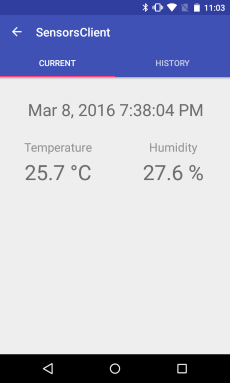
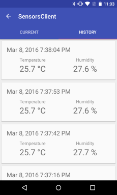

# Project description

This project is Android client for the project Sensors-IoT. The purpose of the app is to fetch from the server and show actual weather data (temperature, humidity) from exact sensor. User is able to select any sensor and check the data reported from it.

   

# Open source libraries
- [Android appcompat v7](https://github.com/android/platform_frameworks_support/tree/master/v7/appcompat)
- [Android support v4](https://github.com/android/platform_frameworks_support/tree/master/v4/java/android/support/v4)
- [Retrofit 2](https://github.com/square/retrofit)
- [OkHttp](https://github.com/square/okhttp)
- [Gson](https://code.google.com/p/google-gson/)
- [Dagger 2](https://github.com/google/dagger)
- [Butter Knife](http://jakewharton.github.io/butterknife/)
- [RxAndroid](https://github.com/ReactiveX/RxAndroid)
 
# Contribution
In case you have ideas or found an issue, don't hesitate to create pull request or an issue.

#License

[Apache Licence 2.0](http://www.apache.org/licenses/LICENSE-2.0)

Copyright 2015 Dmytro Khmelenko

Licensed under the Apache License, Version 2.0 (the "License");
you may not use this file except in compliance with the License.
You may obtain a copy of the License at

    http://www.apache.org/licenses/LICENSE-2.0

Unless required by applicable law or agreed to in writing, software
distributed under the License is distributed on an "AS IS" BASIS,
WITHOUT WARRANTIES OR CONDITIONS OF ANY KIND, either express or implied.
See the License for the specific language governing permissions and
limitations under the License.
